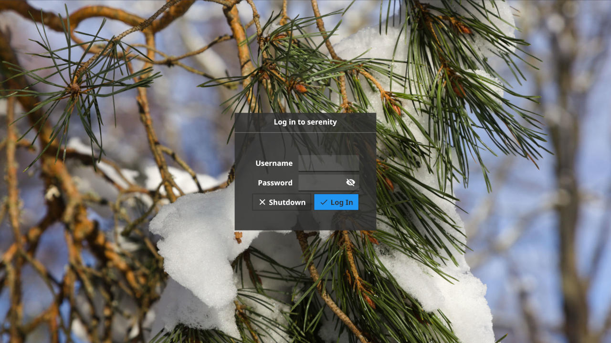

# Fin, the Fyne Login Manager

A minimal but good-looking login manager for Linux/Unix.
The current boot scripts support only systemd.

If you'd like to try out this project in its early stages
then you can simply check out this repo and run:

```shell
$ make
$ sudo make install
$ systemctl disable display-manager
$ systemctl enable fin
```

You can then either reboot or start fin directly with:

```shell
$ systemctl start fin
```

That should be all you need if you are transitioning away from
another Display Manager. If you run into issues using Fin,
please visit [Troubleshooting](# Troubleshooting) below.


# Screenshot

The current version of fin looks like this:



# Development

The Fin login app can be tested easily by running as a normal
Fyne application (with `go run .`) or by running it within a
Xephyr window (we provide `make embed` to help).

Once you are ready to test as your display manager replacement,
you should execute `make && sudo make install` and restart the
`fin` service.


# Troubleshooting

## Logging in Fails
### Problem
When attempting to log in, authentication fails despite using
the correct username and password.
### Solution
Fin, like most other Display Managers, makes use of PAM, the
Pluggable Authentication Module system. This requires the
appropriate rules be in place. The following snippet creates a
`display_manager` module by copying the login one. It must be
run as `root`:
`install -Dm00644 /etc/pam.d/login /etc/pam.d/display_manager`


## Audio Issues
### Problem
I'm using PulseAudio, and I had sound before using `startx`.
Now, using Fin, PulseAudio doesn't recognize any of my
audio inputs or outputs. `pavucontrol` shows dummy sinks.

### Solution
Fin uses `bash --login` to run your `.xinitrc`, and therefore
imposes stricter requirements than `startx`. Create an `audio`
group if it does not already exist, and add your user to it.
Log out and back in to reload the group list.


## Notifications No Longer Work
### Problem
DBUS is not initialized properly in the `.xinitrc` you're using.
This is due to your `XDG` variables (which `startx` handles for
you) not being set properly. See
[this issue](https://github.com/FyshOS/fin/issues/5) for more
details.
### Solution
Be sure your XDG variables are set, such as
`export XDG_RUNTIME_DIR=/run/user/$(id -u)` towards the top of
your `.xinitrc`. Failing to do so breaks dbus and as a result,
systemctl in user mode. Be sure your `.xinitrc` is compliant
with the recommendations of your distro, and properly sources
config files from `/etc/X11/xinit/xinitrc.d` (if applicable).
