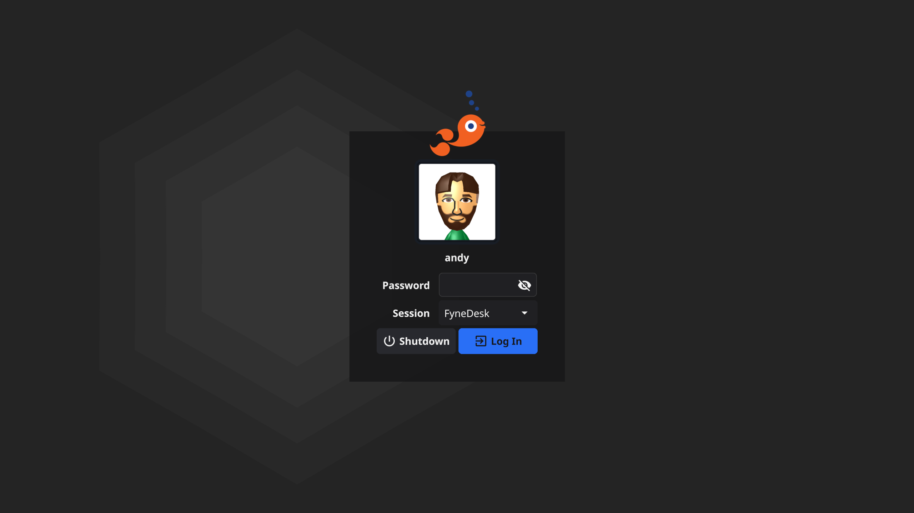

# Fin, the Fyne Login Manager

A minimal but good-looking login manager for Linux/Unix.
The current boot scripts support only systemd.

If you'd like to try out this project in it's early stages
then you can simply check out this repo and run:

```shell
$ make
$ sudo make install
$ systemctl disable display-manager
$ systemctl enable fin
```

You can then either reboot or start fin directly with:

```shell
$ systemctl start fin
```

That should be all you need

# Screenshot

The current version of fin looks like this:



# Development

The Fin login app can be tested easily by running as a normal
Fyne application (with `go run .`) or by running it within a
Xephyr window (we provided `make embed` to help).

Once you are ready to test as your display manager replacement
you should execute `make && sudo make install` and restart the
`fin` service.

